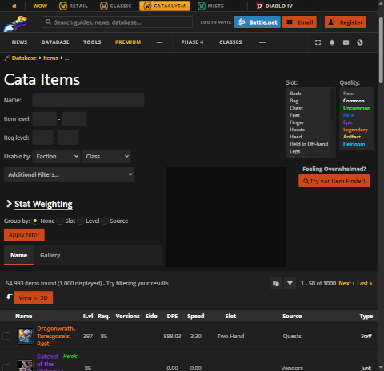

<style>
code{
    font-size: 12px !important;
    padding: 0 !important;
    margin: 0 !important;
}
code > div {
    padding: 0 !important;
    margin: 0 !important;   
}
</style>    
# Baggrund
I slutningen af World of Warcraft (WoW) expansion'en Wrath of the Lich king begyndte den eksponentielle vækst i DPS at tage til.
For at vise dette har jeg scrapet wowhead for item informationer og generede grafer over weapon dps og item stats

# Scraping
wowhead.com er en database over stort set alt WoW relateret.
De levere en version af wowhead som passer til hver af de per dags dato spilbare versioner af WoW.
Konkret har vi scrapet Cataclysm versionen, da den stadigvæk indeholder informationer omkring items fra Wrath of the Lich King

## Item Quality
Til at starte med skal vi bruge Item Quality informationer.
Specefikt er sammenhængen imellem id og farve vigtig.

Den nemmeste måde at finde denne information på er på wowheads itemside, uden filtering.
Siden ser sådan her ud:



Vi bruger selenium webdriver til at hente de item quality informationer vi skal bruge fra boksen `Quality:` på billedet ovenfor
``` python
def process_item_quality_elem(elem):
    _id = int(elem.get_attribute("value"))
    _name = elem.text
    _color = elem.value_of_css_property("color")
    _color = _color[_color.index('(') + 1:]
    _color = _color[:_color.index(')')]
    _color_split = _color.split(', ')
    _color = '#' + "{:02x}".format(int(_color_split[0])) + "{:02x}".format(
        int(_color_split[1])) + "{:02x}".format(int(_color_split[2]))
    return {"id": _id, "name": _name, "color": _color}

items_url = root_url + "/items"
driver.get(items_url)
item_quality_elems = driver.find_elements(By.CSS_SELECTOR, '#filter-facet-quality > option')
item_qualities = pd.DataFrame.from_records(
    [process_item_quality_elem(e) for e in item_quality_elems],
    index='id'
)
```
Den resulterende pandas dataframe har følgende værdier _*index er udeladt_
| id  | name      | color   |
| --- | --------- | ------- |
| 0   | Poor      | #9d9d9d |
| 1   | Common    | #ffffff |
| 2   | Uncommon  | #1eff00 |
| 3   | Rare      | #0070dd |
| 4   | Epic      | #9345ff |
| 5   | Legendary | #ff8000 |
| 6   | Artifact  | #e5cc80 |
| 7   | Heirloom  | #00ccff |

Nu hvor vi har den nødvændige farve data, laver vi en seaborn palette som vi kan bruge senere:
``` python
item_qualities_palette = sns.color_palette(item_qualities['color'])
```

## Item Lists
Nu hvor vi har hentet item quality informationerne er det tid til at finde item id'er
Dette gør vi via. wowheads url filter funktion. Filter funktionen tillader os at filterer på item level, quality og en masse andet vi ikke kommer til at røre ved

``` python
def get_itemlist_url(item_level, quality_id=None):
    result = f"{root_url}/items/min-level:{item_level}/max-level:{item_level}"
    if quality_id != None:
        result += f"/quality:{quality_id}"
    return result
```
_ex: https://www.wowhead.com/cata/items/min-level:0/max-level:0/quality:0_

Vi bruger requests biblioteket til at hente HTML for filtersiden.
Item information for alle items inden for filteret befinder sig allerede i filtersiden når vi modtager den, men den findes kun som en JSON string i et javascript argument
Vi Bruger derfor regex til at pille JSON strengen ud, hvorefter vi parser den med json biblioteket.
``` python
def process_itemlist_url(url):
    rsp = requests.get(url)
    rsp.raise_for_status()
    match_iter = re.findall(r"WH\.Gatherer\.addData\(.*?\);", rsp.text, re.MULTILINE)
    results = []
    for m in match_iter:
        json_str = m[m.index(r'WH.Gatherer.addData('):]
        json_str = json_str[json_str.index(r'{'):]
        json_str = json_str.rstrip(r');')
        json_obj = json.loads(json_str)
        results.append(json_obj)
    result = []
    for row in results:
        for k in row.keys():
            record = record = {'item_id':int(k)} | row[k]
            result.append(record)
    return result
```
Den parsede JSON indeholder alverdens informationer, men det eneste vi skal bruge er item id'erne.

## ItemXML
### Download
Nu hvor vi har en liste over alle item ID'er, kan vi downloade item informationer for de enkelte items som xml.
Til det bruger vi en (meget gammel faktisk) wowhead api. Api'en fungere igen via. en url. i det her tilfælde følges formatet:
```python
f"{root_url}/item={item_id}&xml"
```

Stykket nedenfor sender en HTTP GET request for hvert item_id, som der ikke findes en item xml fil for i forvejen, via. `requests` biblioteket, skriver så resultatet til en fil via `pathlib` biblioteket, og husker de gemte filer i en liste
``` python
item_xml_dir = Path(output_dir + "/itemxml")
item_xml_dir.mkdir(parents=True, exist_ok=True)
item_xml_paths = []
with concurrent.futures.ThreadPoolExecutor() as executor:
    missing_item_xml_urls = {}
    for item_id in itemlist_datas['item_id']:
        filepath = item_xml_dir.joinpath(f"{item_id}.xml").absolute()
        if not filepath.exists():
            missing_item_xml_urls[f"{root_url}/item={item_id}&xml"] = filepath
        else:
            item_xml_paths.append(filepath)
    
    while len(missing_item_xml_urls) > 0:
        futures = {}
        for url, filepath in tqdm(iterable=missing_item_xml_urls.items(), desc="Starting download item XML futures", leave=False, total=len(missing_item_xml_urls)):
            futures[executor.submit(download_file, url, filepath)] = url

        for f in tqdm(iterable=concurrent.futures.as_completed(futures), desc="Downloading Item XML", total=len(futures), leave=False):
            url = futures[f]
            filepath = missing_item_xml_urls[url]
            try:
                rsp = f.result()
                rsp.raise_for_status()
            except:
                pass
            else:
                missing_item_xml_urls.pop(url, None)
                item_xml_paths.append(filepath)

item_xml_paths = pd.Series(item_xml_paths)
item_xml_paths
```

Eksempel på item xml:<br>
_* json og html elementer er forkortet for læsbarhedens skyld_
```xml
<?xml version="1.0" encoding="UTF-8"?>
<wowhead>
 <item id="71086">
  <name><![CDATA[Dragonwrath, Tarecgosa's Rest]]></name>
  <level>397</level>
  <quality id="5">Legendary</quality>
  <class id="2"><![CDATA[Weapons]]></class>
  <subclass id="10"><![CDATA[Staves]]></subclass>
  <icon displayId="99788">stave_2h_tarecgosa_e_01stagefinal</icon>
  <inventorySlot id="17">Two-Hand</inventorySlot>
  <htmlTooltip><![CDATA[<table><tr><td>...]]]></htmlTooltip>
  <json><![CDATA["appearances":{"0":[99788,""]},"classs":2...]]]></json>
  <jsonEquip><![CDATA["appearances":{"0":[99788,""]},"cooldown":1500...]]></jsonEquip>
  <link>https://www.wowhead.com/cata/item=71086/dragonwrath-tarecgosas-rest</link>
 </item>
</wowhead>
```

### Parsing
Når xml filerne for alle item_id'er er downloadet, parses de til henholdvis nye filer i itemjson (json xml element), jsonequip (jsonEquip xml tag) og htmltooltip (htmlTooltip) mapperne.
De resterende xml elementer bliver formateret som en pandas DataFrame, og gemt som .parquet:
``` python
def parse_item_xml(path, overwrite=False):
    root = ElementTree.parse(path).find(".//item")
    class_elem = root.find("class")
    subclass_elem = root.find("subclass")
    quality_elem = root.find("quality")
    icon_elem = root.find("icon")
    inventorySlot_elem = root.find("inventorySlot")
    parsedItem = {
        "id": int(root.attrib['id']),
        "name": root.findtext("name"),
        "level": int(root.findtext("level")),
        "quality_id": int(quality_elem.attrib['id']),
        "quality_name": quality_elem.text,
        "class_id": int(class_elem.attrib['id']),
        "class_name": class_elem.text,
        "subclass_id": int(subclass_elem.attrib['id']),
        "subclass_name": subclass_elem.text,
        "icon_displayId": int(icon_elem.attrib['displayId']),
        "icon_name": icon_elem.text,
        "inventorySlot_id": int(inventorySlot_elem.attrib['id']),
        "inventorySlot_name": inventorySlot_elem.text,
        "link": root.findtext("link")
    }
    json_str = root.findtext("json")
    if (json_str):
        json_filepath = json_dir.joinpath("{}.json".format(parsedItem['id']))
        if(not json_filepath.exists() or overwrite):
            json_filepath.write_text('{' + json_str + '}')

    jsonequip_str = root.findtext("jsonEquip")
    if (jsonequip_str):         
        jsonequip_filepath = jsonequip_dir.joinpath("{}.equip.json".format(parsedItem['id']))
        if(not jsonequip_filepath.exists() or overwrite):
            jsonequip_filepath.write_text('{' + jsonequip_str + '}')

    htmltooltip_str = root.findtext('htmlTooltip')
    if (htmltooltip_str):
        htmltooltip_filepath = htmltooltip_dir.joinpath("{}.htm".format(parsedItem['id']))
        if(not htmltooltip_filepath.exists() or overwrite):
            htmltooltip_filepath.write_text(htmltooltip_str)
    return parsedItem
```
_*Ovenstående benytter xml.etree.ElementTree til at parse item XML filerne_

# Diverse
## Pandas DataFrame fra rækker
Der har været mange tilfælde hvor jeg har en masse datarækker i alverdens formater som jeg så skal have sat sammen til en pandas DataFrame.
Jeg har prøvet mere end en måde at gøre det på, men nedenstående er klart den hurtigste
``` python
records = []
for i in some_iterable:
    record = {'i':i}
    records.append(record)
df = pd.DataFrame.from_records(records)
```
_* Den hurtige del er at samle en liste af records (dictionaries) og så til sidst kalde pd.DataFrame.from_records_

## Async & MultiThreading
For min egen tålmodigheds skyld så findes følgende mønster overalt i min kode:
``` python
records = []
with concurrent.futures.ThreadPoolExecutor() as executor:
    urls = [u for u in unprocessed.keys()]
    futures = {executor.submit(io_func, u):u for u in urls}

    for f in tqdm(iterable=concurrent.futures.as_completed(futures), desc="Doing IO", total=len(futures), leave=False):
        u = urls[f]
        try:
            data = f.result()
        except:
            pass
        else:
            records.append(data)
```

I ovenstående bruges `concurrent.futures.ThreadPoolExecutor` til at gøre mine IO dependant funktioner både asynkrone og parallele, hvilket øger performance gevaldigt.
`concurrent.futures.as_completed` itererer bare over futures der er completed, om de er fejlet eller ej

`tqdm` biblioteket bruges til at output'e progress status barer. Den bor på stort set alle mine loops, da det er nemmere at vente på store operationer når du ved hvor langt du er.
`leave=True` parametret betyder bare at process baren forsvinder når loop'et er overstået
