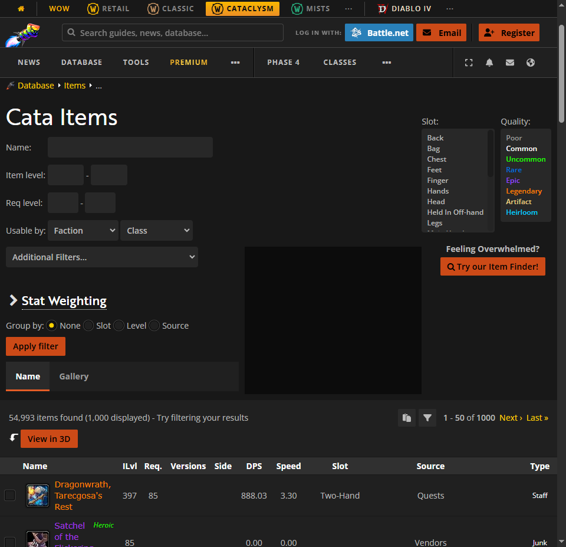

# Baggrund
I slutningen af World of Warcraft (WoW) expansion'en Wrath of the Lich king begyndte den eksponentielle vækst i DPS at tage til.
For at vise dette har jeg scrapet wowhead for item informationer og generede grafer over weapon dps og item stats

# Scraping
wowhead.com er en database over stort set alt WoW relateret.
De levere en version af wowhead som passer til hver af de per dags dato spilbare versioner af WoW.
Konkret har vi scrapet Cataclysm versionen, da den stadigvæk indeholder informationer omkring items fra Wrath of the Lich King

## Item Quality
Til at starte med skal vi bruge Item Quality informationer.
Specefikt er sammenhængen imellem id og farve vigtig.

Den nemmeste måde at finde denne information på er på wowheads itemside, uden filtering.
Siden ser sådan her ud


Vi bruger selenium webdriver til at hente de item quality informationer vi skal bruge.
``` python
def process_item_quality_elem(elem):
    _id = int(elem.get_attribute("value"))
    _name = elem.text
    _color = elem.value_of_css_property("color")
    _color = _color[_color.index('(') + 1:]
    _color = _color[:_color.index(')')]
    _color_split = _color.split(', ')
    _color = '#' + "{:02x}".format(int(_color_split[0])) + "{:02x}".format(
        int(_color_split[1])) + "{:02x}".format(int(_color_split[2]))
    return {"id": _id, "name": _name, "color": _color}

items_url = root_url + "/items"
driver.get(items_url)
item_quality_elems = driver.find_elements(By.CSS_SELECTOR, '#filter-facet-quality > option')
item_qualities = pd.DataFrame.from_records(
    [process_item_quality_elem(e) for e in item_quality_elems],
    index='id'
)
```
Den resulterende pandas dataframe har følgende værdier _*index er udeladt_
| id | name | color |
| --- | --- | --- |
0 | Poor | #9d9d9d
1 | Common | #ffffff
2 | Uncommon | #1eff00
3 | Rare | #0070dd
4 | Epic | #9345ff
5 | Legendary | #ff8000
6 | Artifact | #e5cc80
7 | Heirloom | #00ccff

Nu hvor vi har den nødvændige farve data, laver vi en seaborn palette som vi kan bruge senere:
``` python
item_qualities_palette = sns.color_palette(item_qualities['color'])
```